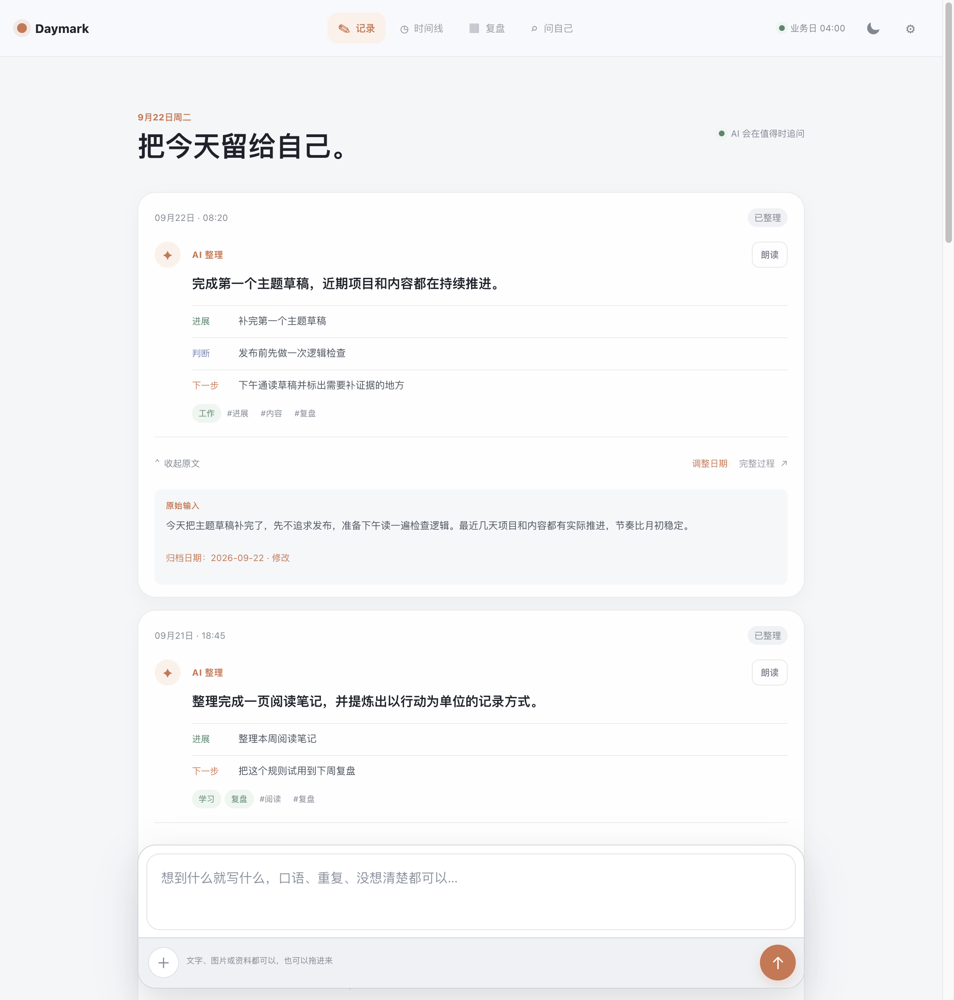
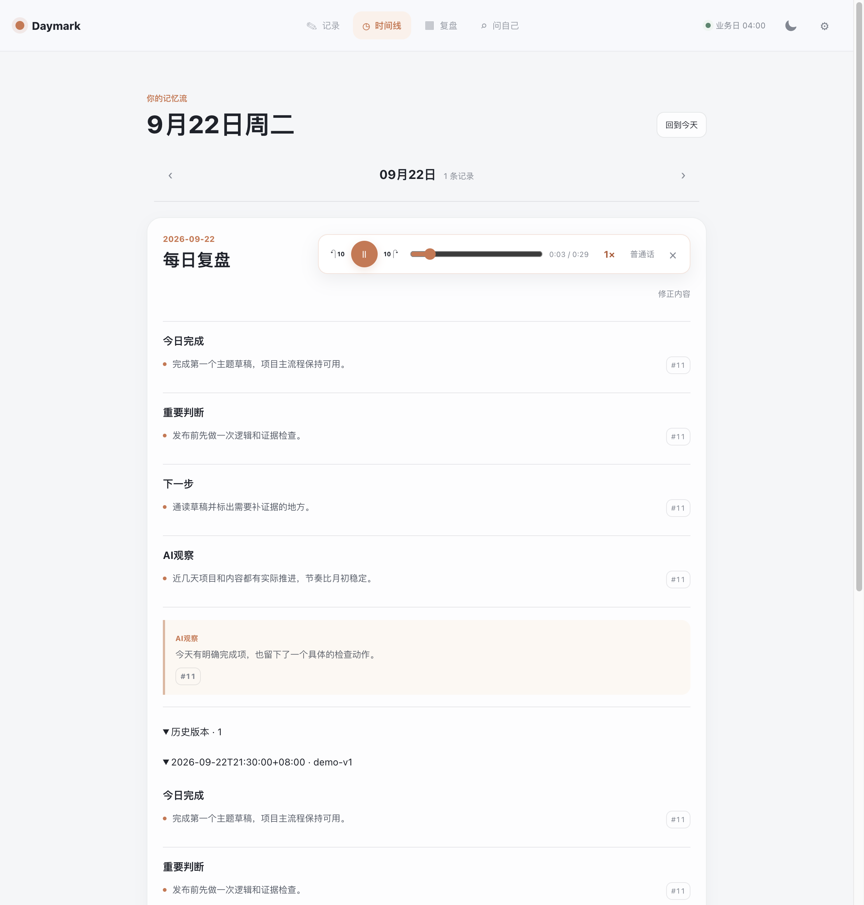
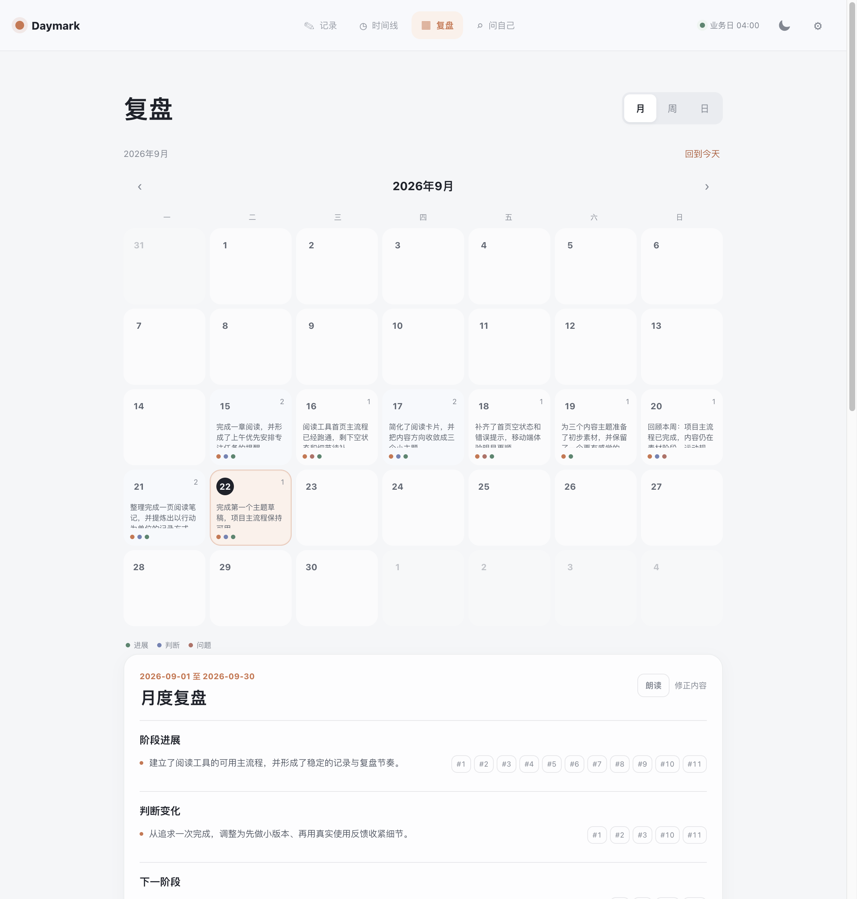
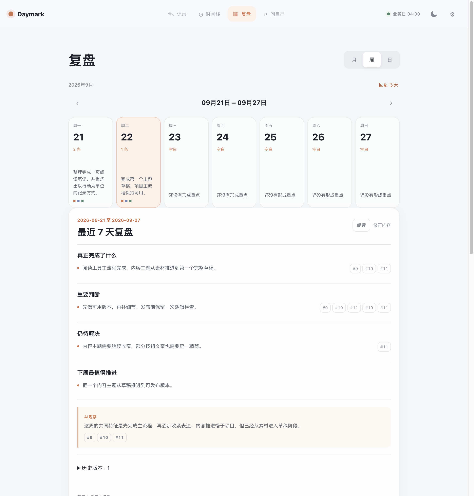
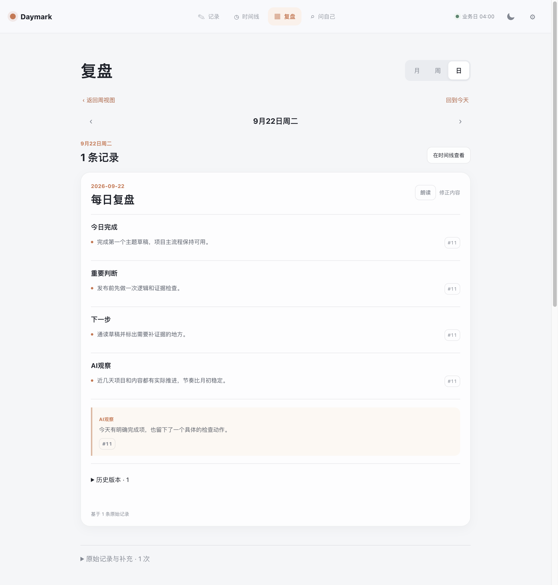
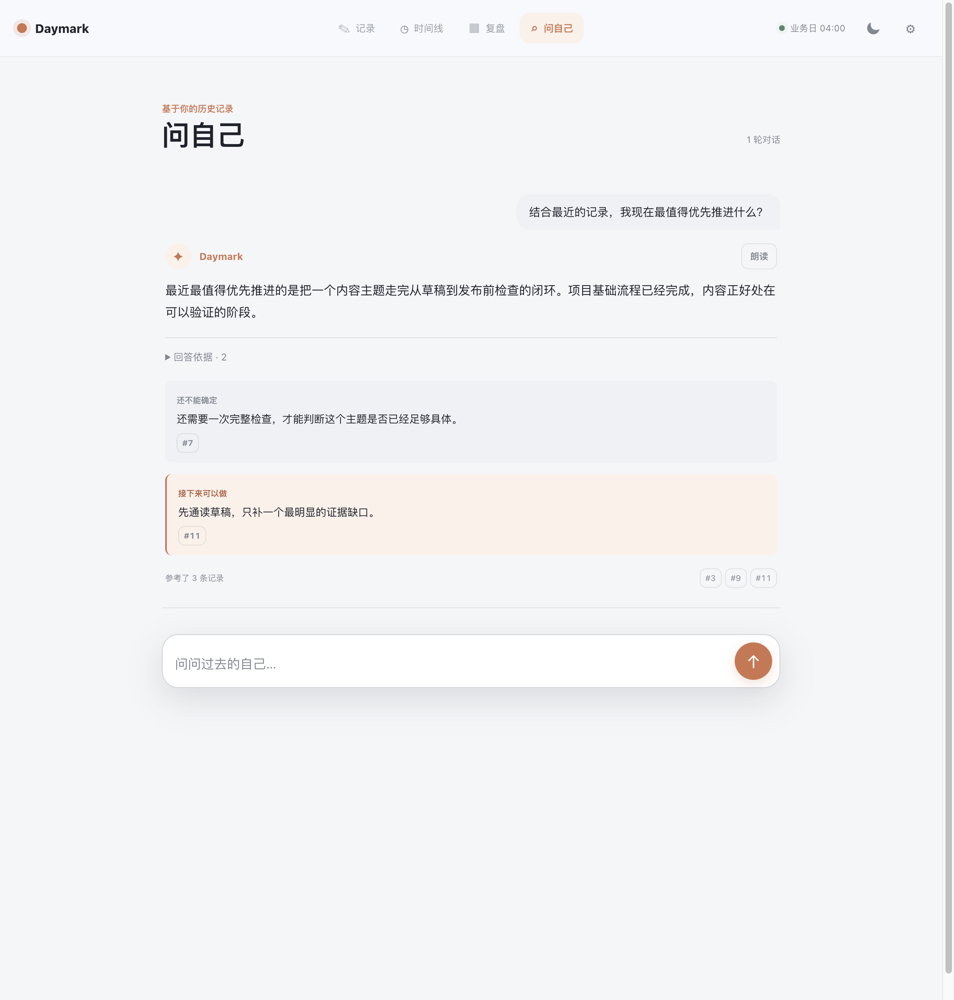
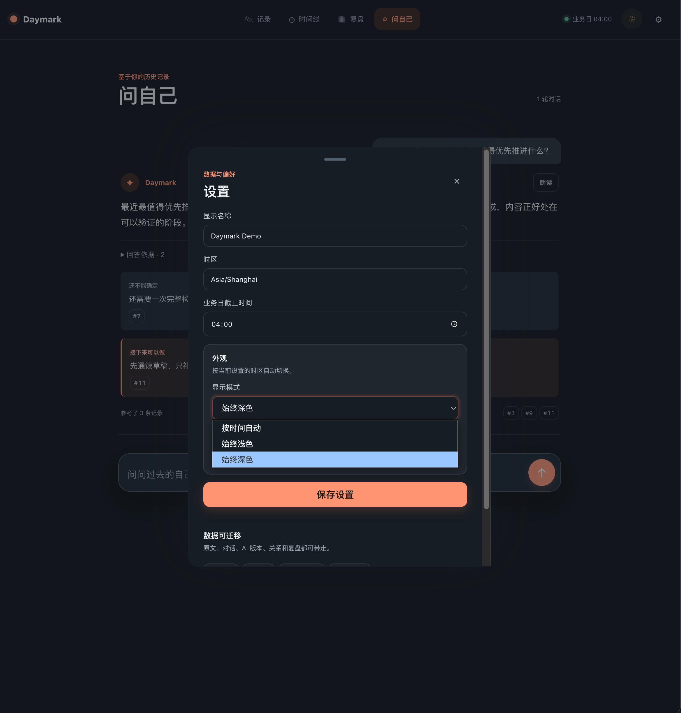
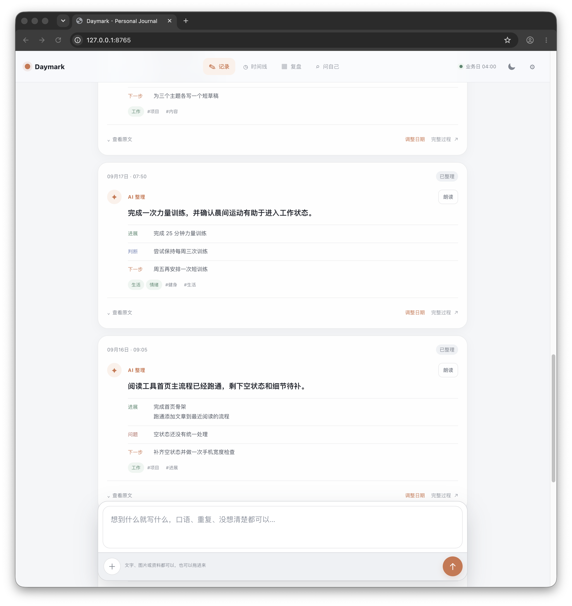

# Daymark

[English](README.md) | [简体中文](README.zh-CN.md)

Daymark is a private AI recording and review system for work and life. Write the way you would send a message—fragmented thoughts, voice-to-text, repeated ideas, and unfinished decisions are all welcome. Daymark uses AI to turn that raw input into structured records, asks a follow-up only when an important ambiguity would affect future review, and builds evidence-backed daily and cross-period reflections over time.

The original text is always preserved. AI summaries, follow-up conversations, date corrections, reports, and their source records are stored separately, so every conclusion can be traced back to what was actually written at the time.

## Preview

These screenshots use synthetic demo data only.

<table>
  <tr>
    <td align="center"><br><sub>AI-organized record</sub></td>
    <td align="center"><br><sub>Timeline</sub></td>
  </tr>
  <tr>
    <td align="center"><br><sub>Calendar month view</sub></td>
    <td align="center"><br><sub>Calendar week view</sub></td>
  </tr>
  <tr>
    <td align="center"><br><sub>Calendar day view</sub></td>
    <td align="center"><br><sub>Ask yourself</sub></td>
  </tr>
  <tr>
    <td align="center"><br><sub>Dark mode</sub></td>
    <td align="center"><br><sub>Review summary</sub></td>
  </tr>
</table>

## How it works

1. **Record naturally** — type or use system voice-to-text without filling in forms or choosing categories first.
2. **AI understands the entry** — it identifies the actual date, topics, progress, decisions, problems, assumptions, and next actions.
3. **Follow up only when it matters** — if a key decision or conclusion is genuinely ambiguous, Daymark asks one focused question. You can always skip it.
4. **Review across time** — daily, weekly, and calendar views connect individual records into progress, recurring problems, changing judgments, and practical next steps.

## Core capabilities

- AI-first record cards that highlight the useful interpretation while keeping the complete original text available as evidence.
- Context-aware follow-up questions for important ambiguity, without turning recording into a questionnaire.
- Intelligent record dates, explicit backdating, and a configurable business-day cutoff.
- Timeline plus month, week, and day calendar review views.
- Evidence-backed daily and seven-day reports with links to their source entries.
- “Ask yourself” conversations grounded in saved history rather than a model's unsupported memory.
- Current-focus rollups that consolidate repeated suggestions into a small number of meaningful directions.
- Image, document, and file attachments alongside text records.
- Local SQLite storage with JSON, Markdown, and SQLite export for migration and backup.
- Responsive PWA-oriented interface for desktop and mobile browsers, including light and dark modes.

## Requirements

- Python 3.10 or newer
- An OpenAI-compatible API endpoint, API key, and supported model IDs
- No third-party Python package is required for the application server

## Run Locally

1. Copy the example configuration:

   ```bash
   cp .env.example .env
   ```

2. Add your OpenAI-compatible API endpoint, API key, and model IDs to `.env`.

3. Start Daymark:

   ```bash
   python3 app.py
   ```

Open `http://127.0.0.1:8765`. To use another device on the same network, set `JOURNAL_HOST=0.0.0.0` and open the LAN address printed by the server. Do not expose the development server directly to the public internet.

The first run creates an empty SQLite database at `data/journal.sqlite3`. The database and uploaded files are intentionally ignored by Git.

Daymark saves the original text before an AI request is made, so a temporary provider failure does not lose a record. An API key is still required for the product's core AI organization, follow-up, report, and historical-analysis features; running without one is only a data-preservation fallback, not the intended Daymark experience.

## AI Configuration

Copy `.env.example` to `.env` and configure your provider. Model identifiers vary by provider; replace the examples with models available to your account.

```dotenv
OPENAI_BASE_URL=https://api.openai.com/v1
OPENAI_API_KEY=your-key
OPENAI_MODEL_SIMPLE=gpt-4o-mini
OPENAI_MODEL_REASONING=gpt-4o
OPENAI_MODEL_REPORT=gpt-4o-mini
OPENAI_MODEL_LONG=gpt-4o
```

Keep `.env` local. Never commit API keys, tokens, passwords, personal databases, exports, logs, or uploaded files.

## Data and Privacy

The application is designed for personal, local-first use. SQLite is the source of truth for original entries, conversation messages, AI versions, reports, corrections, relationships, proposals, and rollups. Exported data is intended for migration and testing. The public repository contains no personal database or real user records.

For production use, put the app behind HTTPS, keep the database on a persistent private volume, and configure backups outside the repository.

## Tests

```bash
python3 -m unittest discover -s tests -p 'test_*.py'
node --test tests/*.test.cjs
```

The test suite uses temporary databases and synthetic example text.

## License

MIT. See [LICENSE](LICENSE).
